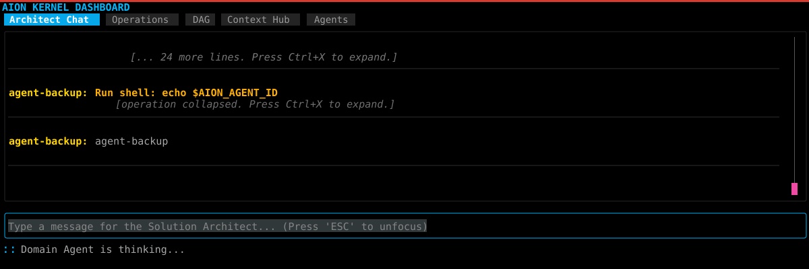

# Aion-Kernel

A 3-Tier Multi-Agent Orchestration OS for concurrent AI agent operations on a shared codebase.



## Architecture

- **Tier 1 — Orchestrator** (Go Daemon): Central kernel managing state, locking, IPC, and process supervision. Contains zero AI logic.
- **Tier 2 — Domain Agent Supervisor** (Go Process): Lightweight supervisor per domain that manages a Pi Agent subprocess lifecycle.
- **Tier 3 — Pi Agent** (Node.js, RPC Mode): The brain. Runs reasoning loops, writes code, communicates with the Orchestrator via `orchestrator-cli`.

## Quick Start

```bash
# Install build tools (flatc, protoc plugins)
make install-tools

# Generate code from schemas
make flatbuf
make proto

# Build binaries
make build

# Run tests
make test
```

## Usage

You can find the compiled binaries in the `bin/` directory after running `make build`.

### 1. Run the Orchestrator Server (Standalone)
Start the orchestrator daemon in the background or another terminal:
```bash
./bin/aion-kernel server --config configs/aion.yaml
```

The daemon operates on the current directory by default. To run Aion against a
different project from anywhere, pass an explicit project root:

```bash
./bin/aion-kernel server --workdir /path/to/project --config /path/to/aion.yaml
```

If `--config` is omitted, config discovery checks:

1. `<project>/aion.yaml`
2. `<project>/.aion/aion.yaml`
3. `<project>/configs/aion.yaml`
4. binary-adjacent `configs/aion.yaml`
5. built-in defaults

Environment loading uses kernel defaults with project overrides:

1. `<kernel-root>/.env` where `kernel-root` is resolved from the executable path
   or `AION_KERNEL_ROOT`
2. `~/.config/aion-kernel/.env`
3. `<project>/.env`

The project `.env` is loaded last, so project-specific values can override the
kernel defaults when needed.

### 2. Run an End-to-End Orchestration Task
Submit a task prompt to the Orchestrator to begin planning and allocating agents over the current directory:
```bash
./bin/aion-kernel run --config configs/aion.yaml --prompt "Refactor the authentication logic to use JWTs"
```

### 3. Use the CLI to interact with the DAG
If the server is running, you can manually interact with the Orchestrator via the CLI Pi Agent skill:
```bash
# Read a specific node from the active state
./bin/orchestrator-cli read-dag --node-id "node-123"

# Query the semantic memory (requires memory to be enabled in config)
./bin/orchestrator-cli query-memory --text "authentication" --top-k 5
```

## Project Structure

```
kernel/
├── cmd/
│   ├── orchestrator/         # Orchestrator daemon
│   └── orchestrator-cli/     # CLI for agent ↔ orchestrator comms
├── internal/
│   ├── orchestrator/         # Core daemon logic
│   ├── dag/                  # DAG state (FlatBuffer + mmap + WAL)
│   ├── locking/              # File-level lock manager
│   ├── supervisor/           # Agent process supervisor
│   ├── hub/                  # Context Hub message routing
│   ├── coordinator/          # Coordinator plugin (DAG planner)
│   ├── stub/                 # Stub contract management
│   └── memory/               # Semantic memory (Chromem-Go)
├── proto/                    # Protobuf service definitions
├── flatbuf/                  # FlatBuffer schema files
├── skills/                   # Pi Agent skills
├── install/                  # systemd install templates and setup helpers
├── configs/                  # Configuration files
└── test/                     # Integration tests & mocks
```

## Configuration

See `configs/aion.yaml` and `.env.example` for the default configuration.
For long-running agent turns, tune `AION_PROGRESS_TIMEOUT_SEC`,
`AION_EXTERNAL_ACTIVITY_STALE_TIMEOUT_SEC`, and
`AION_EXTERNAL_ACTIVITY_MAX_DURATION_SEC` so queued or in-flight gateway
requests are not mistaken for stalled agents.
For `/build-spec` planner handoff diagnosis, tune
`AION_COORDINATOR_PLANNER_START_TIMEOUT_SEC` and
`AION_COORDINATOR_PLANNER_FIRST_REQUEST_TIMEOUT_SEC`. To bound the full
Coordinator plan artifact wait, tune
`AION_COORDINATOR_PLANNER_ARTIFACT_TIMEOUT_SEC`.
The Coordinator writes attempt-scoped planning files under
`docs/aion/planning/<attempt_id>/`. It writes `plan_response.json` directly;
the daemon waits for complete JSON and a valid plan before mutating the DAG.

Gateway retries are controlled by `AION_INFERENCE_GATEWAY_MAX_RETRIES`,
`AION_INFERENCE_GATEWAY_RETRY_BASE_DELAY_MS`, and
`AION_INFERENCE_GATEWAY_RETRY_MAX_DELAY_MS`. Runtime concurrency can be changed
with `orchestrator-cli set-gateway-capacity --capacity <N>` or the dashboard's
`/gateway-capacity <N>` command. `/stop-agents` pauses active Domain Agents
without failing their DAG nodes; `/continue-agents` resumes them.

Domain agents run from filtered per-agent source workspaces under the system
temp directory. Each workspace contains `AGENTS.md` plus symlinks for only the
domain's assigned paths, so runtime and control directories such as `.aion/`,
`.git/`, `.agents/`, and `.codex/` are not visible from a normal `ls -la`.
`.aionignore` still controls scan/planning exclusions, but the filtered
workspace is the enforcement boundary for domain-agent file discovery.

## Documentation

See `docs/current/implementation_arch.md` for the full architecture specification.
